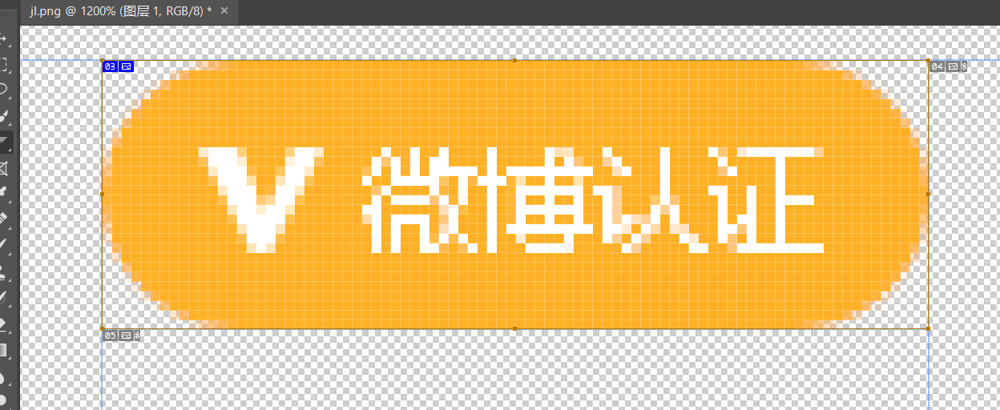

div 用于配合css完成布局，span用于修改局部样式

div是容器级元素，可以放其他所有标签，且会独占一行

span是文本级标签，只能放文本图片超链接，不会独占一行

# 显示模式

## 块级元素

常见，div，p，h，td，li等

块级元素会独占一行

可以设置宽高，默认和父元素一样宽高

## 行内元素

常见，span

不会独占一行

不可以设置宽高，宽高和内容一样

## 行内块级元素

常见 img

不会独占一行

可以设置宽高，默认和内容一样


## 切换

通过设置`display`属性改变，显示模式

```css
div{
    display: inline;
    background: red;
    width: 200px;
    height: 100px;
}
```

`inline`: 行内元素

`block` :块级元素

`inline-block` ：行内块级元素

# 背景

设置**背景颜色**

```css
background-color: red;
```

**背景图片**

```css
background-image: url(img/a.gif);
```

图片会自动平铺扩展,与背景颜色同时设置会覆盖背景颜色

通过设置bg-repeat控制**平铺**

```css
background-repeat: repeat;
```

`repeat`:全平铺

`no-repeat` 不平铺

`repeat-x` 水平方向平铺

`repeat-y` 垂直方向平铺 

设置**定位**

```css
 background-position: 20% bottom;
```

第一个值为，水平方向x轴的位置

第二个值为，垂直方向y轴的位置

取值

1,名词

x:left center right

y:top center bottom

2，px

如：200px,可以指定负值

3，%

如 20%，可以指定负值

设置**关联方式**

```css
background-attachment: scroll;
```

`scroll` : 可以滚动

`fixed` 固定模式.图片不会随滚动条滚动

**简写**

```css
background: url("img/a.gif") no-repeat red  fixed;
```

通过`background`设置多个属性

**精灵图**

通过多个小图片组成，只加载一次，多次使用


ps打开，选择切片工具


放大图片后，选择要切的图标,调整宽高位置




在目标切片上右键选择,编辑切片选项


得到宽高wh和坐标xy


编辑代码

```css
div{
    background: url("img/jl.png") no-repeat -425px -50px;
    width:86px;
    height: 28px;
}
```

设置宽高,xy坐标设置为负数

浏览器即可得到指定图标


