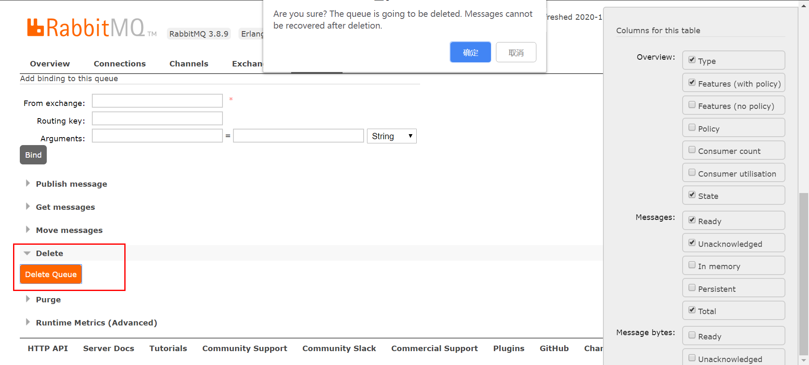

# HelloWorld

最简单的消息消费模型，生产者producer发送消息到指定名称的队列，消费者consumer从队列中获取消息。


引入依赖

```xml
<dependency>
    <groupId>com.rabbitmq</groupId>
    <artifactId>amqp-client</artifactId>
    <version>5.7.1</version>
</dependency>
```

生产者

```java
import com.rabbitmq.client.Channel;
import com.rabbitmq.client.Connection;
import com.rabbitmq.client.ConnectionFactory;
import lombok.extern.slf4j.Slf4j;

@Slf4j
public class DemoProducer {

    public static void main(String[] args) {
        log.info("开始发送");
        ConnectionFactory connectionFactory = new ConnectionFactory();
        connectionFactory.setHost("192.168.24.130");
        connectionFactory.setPort(5672);
        try (Connection connection = connectionFactory.newConnection();
             Channel channel = connection.createChannel()) {

            String queueName = "testQueue1";
            channel.queueDeclare(queueName, false, false, false, null);
            String msg = "hello rabbit";

            channel.basicPublish("", queueName, null, msg.getBytes());

            log.info("发送完成");

        } catch (Exception e) {
            log.error("发送异常",e);
        }
    }
}
```

消费者 

注意，这里不能使用`try-with-resource` ，需要保持连接一直激活。

```java
import com.rabbitmq.client.Channel;
import com.rabbitmq.client.Connection;
import com.rabbitmq.client.ConnectionFactory;
import com.rabbitmq.client.DeliverCallback;
import lombok.extern.slf4j.Slf4j;

import java.nio.charset.StandardCharsets;

@Slf4j
public class DemoConsumer {
    public static void main(String[] args) throws Exception {
        ConnectionFactory connectionFactory = new ConnectionFactory();
        connectionFactory.setHost("192.168.24.130");
        connectionFactory.setPort(5672);
        Connection connection = connectionFactory.newConnection();
        Channel channel = connection.createChannel();
        String queueName = "testQueue1";
        channel.queueDeclare(queueName,false,false,false,null);

        DeliverCallback deliverCallback= (consumerTag, message) -> {
            String msg = new String(message.getBody(), StandardCharsets.UTF_8);
            log.info(msg);
        };
        channel.basicConsume(queueName, true, deliverCallback, consumerTag -> {});
        log.info("启动监听");
    }
}
```

# 工作队列

工作队列，将用于多个消费者之间的任务分发


修改我们的消费者 , 使其执行任务的时候花费一秒（用sleep模拟），启动的时候试用命令行参数区分不同的consumer

```java
DeliverCallback deliverCallback = (consumerTag, message) -> {
    String msg = new String(message.getBody(), StandardCharsets.UTF_8);
    log.info("接受消息：" + msg);
    try {
        TimeUnit.SECONDS.sleep(1L);
    } catch (InterruptedException e) {
        e.printStackTrace();
    }
    log.info("处理完成:" + msg);
};
channel.basicConsume(queueName, true, deliverCallback, consumerTag -> {
});
log.info("启动监听" + args[0]);
```

启动两个消费者 ，分别为 c1,c2

生产者，发送多条消息

```java
for (int i = 0; i < 10; i++) {
    String msg = "hello rabbit:" + i;
    channel.basicPublish("", queueName, null, msg.getBytes());
}
```

得到日志，队列会以轮询的方式发送给消费者，每个消费者将收到等量的消息

```java
2020-10-30 14:34:43.313  INFO - [ main] com.plf.rbt.DemoConsumer  : 启动监听c1 
2020-10-30 14:34:53.580  INFO - [ead-4] com.plf.rbt.DemoConsumer  : 接受消息：hello rabbit:0 
2020-10-30 14:34:54.580  INFO - [ead-4] com.plf.rbt.DemoConsumer  : 处理完成:hello rabbit:0 
2020-10-30 14:34:54.580  INFO - [ead-4] com.plf.rbt.DemoConsumer  : 接受消息：hello rabbit:2 
2020-10-30 14:34:55.581  INFO - [ead-4] com.plf.rbt.DemoConsumer  : 处理完成:hello rabbit:2 
2020-10-30 14:34:55.581  INFO - [ead-4] com.plf.rbt.DemoConsumer  : 接受消息：hello rabbit:4 
2020-10-30 14:34:56.581  INFO - [ead-4] com.plf.rbt.DemoConsumer  : 处理完成:hello rabbit:4
...
```

```java
2020-10-30 14:34:47.451  INFO - [ main] com.plf.rbt.DemoConsumer  : 启动监听c2 
2020-10-30 14:34:53.580  INFO - [ead-4] com.plf.rbt.DemoConsumer  : 接受消息：hello rabbit:1 
2020-10-30 14:34:54.580  INFO - [ead-4] com.plf.rbt.DemoConsumer  : 处理完成:hello rabbit:1 
2020-10-30 14:34:54.580  INFO - [ead-4] com.plf.rbt.DemoConsumer  : 接受消息：hello rabbit:3 
2020-10-30 14:34:55.581  INFO - [ead-4] com.plf.rbt.DemoConsumer  : 处理完成:hello rabbit:3 
2020-10-30 14:34:55.581  INFO - [ead-4] com.plf.rbt.DemoConsumer  : 接受消息：hello rabbit:5 
2020-10-30 14:34:56.581  INFO - [ead-4] com.plf.rbt.DemoConsumer  : 处理完成:hello rabbit:5 
...
```

## 消息确认机制

由于我们收到消息后，处理一条消息需要花费时间，如果在处理的过程中，服务挂掉了，就会处理失败，将会丢失发送给该服务的消息，我们不想丢失任何消息，希望服务挂掉时，正在处理的这条消息重新发送给正常的消费者继续处理。

之前一直都是自动确认消息，需要改为消息消费成功后手动确认消息

```java
DeliverCallback deliverCallback = (consumerTag, message) -> {
    String msg = new String(message.getBody(), StandardCharsets.UTF_8);
    log.info("接受消息：" + msg);
    try {
        TimeUnit.SECONDS.sleep(3L);
    } catch (InterruptedException e) {
        e.printStackTrace();
    }
    log.info("处理完成:" + msg);
    // 手动确认消息
    channel.basicAck(message.getEnvelope().getDeliveryTag(),false);
};
// 关闭自动确认消息
boolean autoAck = false;
channel.basicConsume(queueName, autoAck, deliverCallback, consumerTag -> {});
```

**注意** , 忘记手动确认消息，很常见简单，但是后果很严重，消息将一直得不到确认，队列中的消息会越攒越多，直到内存溢出，重启消费者，又会发送之前未处理的消息。

## 消息持久性

消息确认机制保证了，消费者挂掉时，消息不会丢失。但是，我们的 rabbitmq-server 如果挂掉了，暂存在队列中的消息，还是会丢失。这时就需要用到消息持久化。

创建队列的时候，指定 durable 属性为 true ，开启持久化，消费者和生产者两边的声明都需要改。

```java
String queueName = "testQueue1";
boolean durable = true;
channel.queueDeclare(queueName, durable, false, false, null);
```

但是服务器上如果已经存在一个同名的queue，是不允许使用不同的参数去修改的，我们可以换个名称，或者在控制台去删除掉之前的queue



发送消息时，指定属性为`MessageProperties.PERSISTENT_TEXT_PLAIN`

```java
channel.basicPublish("", queueName, MessageProperties.PERSISTENT_TEXT_PLAIN, msg.getBytes()); 
```

此时发送消息就会持久化到硬盘，重启rabbitmq-server ，消息还是会在。

可以在控制台queues下查看消息状态，可以点击`+/-` 控制展示的列，消息已经持久化了。


## 公平派遣

多个消费者的情况，默认将会轮询的方式，不管消费者忙，还是空闲，都会固定分发，可能不同的消息处理起来花费的时间不同，或者不同消费者所在的机器性能也不一样。我们希望，资源可以合理分发，任务优先分配给空闲的消费者。

通过设置 `prefetchCount=1` ，保证一个消费者一次只接受一条未确认的消息，当消费者还在处理数据时，不会再给其发送消息，而是发送给空闲的其他消费者。

```java
// 只接受一条未确认的消息
int prefetchCount = 1;
channel.basicQos(prefetchCount);

DeliverCallback deliverCallback = (consumerTag, message) -> {
    String msg = new String(message.getBody(), StandardCharsets.UTF_8);
    log.info("接受消息：" + msg);
    Integer msgValue = Integer.valueOf(msg);
    // 为偶数则消耗时间
    if (msgValue%2==0){
        try {
            TimeUnit.SECONDS.sleep(3L);
        } catch (InterruptedException e) {
            e.printStackTrace();
        }
    }
    log.info("处理完成:" + msg);
    channel.basicAck(message.getEnvelope().getDeliveryTag(),false);
};
```

发送者直接发送count

```java
for (int i = 0; i < 10; i++) {
    String msg = ""+i;
    channel.basicPublish("", queueName, MessageProperties.PERSISTENT_TEXT_PLAIN, msg.getBytes());
}
```

# 发布订阅

# 路由模式

# 主题模式

# RPC

# 消息确认

消息持久化保证了server接受到消息后，消息不会丢失，但是server把内存中的消息写入硬盘还是需要时间的，此时挂了，或者生产者发送的时候，由于网络等问题，server并没有收到消息，此时发送出去的消息就会丢失。

此时可以使用，发送消息确认，发送之前开启，发送完后等待确认结果。

```java
// 开启发送确认
channel.confirmSelect();
for (int i = 0; i < 10; i++) {
    String msg = "hello rabbit:" + i;
    channel.basicPublish("", queueName, MessageProperties.PERSISTENT_TEXT_PLAIN, msg.getBytes());
}
// 等待确认发送成功
if (channel.waitForConfirms()){
    log.info("发送完成");
}
```

可以使用四种方法确认

```java
// 等待发送完成，如果有消息未确认，返回false，可以指定一个超时时间
boolean waitForConfirms();
boolean waitForConfirms(long timeout);
// 等待发送完成，如果有消息未确认，抛出异常，可以指定一个超时时间
void waitForConfirmsOrDie();
void waitForConfirmsOrDie(long timeout);
```

还可以指定一个监听器，用于发送消息时的回调。

```java
channel.addConfirmListener(new ConfirmListener() {
    @Override
    public void handleAck(long deliveryTag, boolean multiple) throws IOException {
        log.info("发送成功:"+deliveryTag);
    }

    @Override
    public void handleNack(long deliveryTag, boolean multiple) throws IOException {
        log.error("发送失败:"+deliveryTag);
    }
});
```

可以替换为lambda语法，传入两个 ConfirmCallback

```java
channel.addConfirmListener((deliveryTag, multiple) -> log.info("发送成功:"+deliveryTag),
                           (deliveryTag, multiple) -> log.error("发送失败:"+deliveryTag));
```

## 

