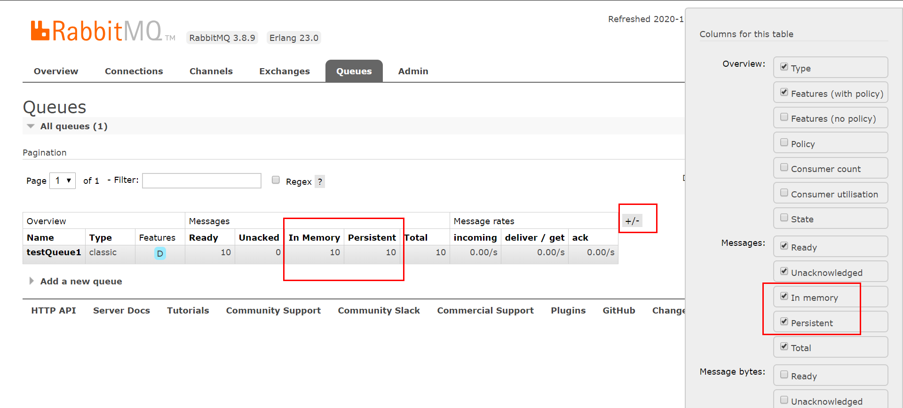
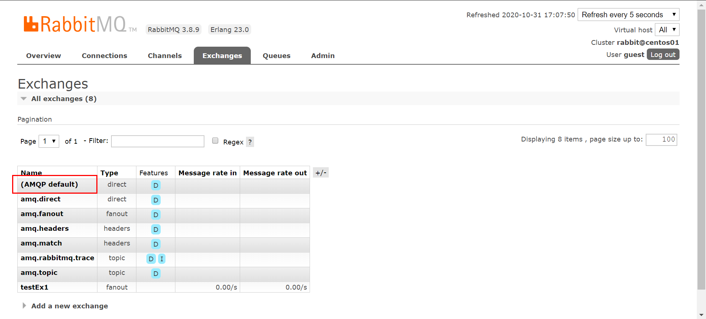
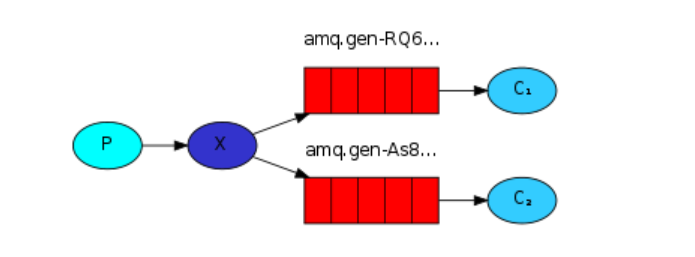
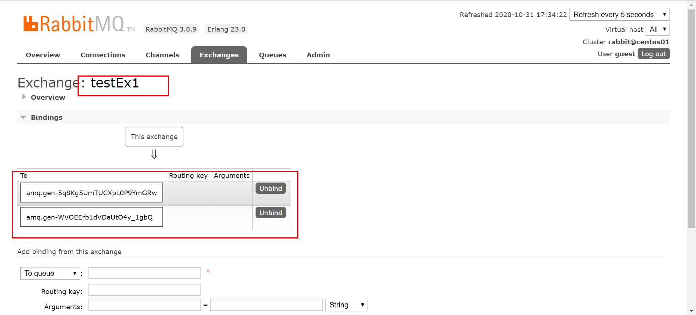
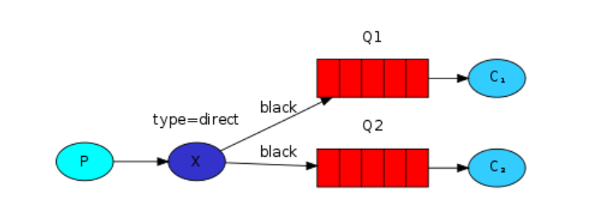

# HelloWorld

最简单的消息消费模型，生产者(producer)发送消息到指定名称的队列 (queue)，消费者(consumer)从队列中获取消息。


引入依赖

```xml
<dependency>
    <groupId>com.rabbitmq</groupId>
    <artifactId>amqp-client</artifactId>
    <version>5.7.1</version>
</dependency>
```

生产者

```java
import com.rabbitmq.client.Channel;
import com.rabbitmq.client.Connection;
import com.rabbitmq.client.ConnectionFactory;
import lombok.extern.slf4j.Slf4j;

@Slf4j
public class DemoProducer {

    public static void main(String[] args) {
        log.info("开始发送");
        ConnectionFactory connectionFactory = new ConnectionFactory();
        connectionFactory.setHost("192.168.24.130");
        connectionFactory.setPort(5672);
        try (Connection connection = connectionFactory.newConnection();
             Channel channel = connection.createChannel()) {

            String queueName = "testQueue1";
            channel.queueDeclare(queueName, false, false, false, null);
            String msg = "hello rabbit";

            channel.basicPublish("", queueName, null, msg.getBytes());

            log.info("发送完成");

        } catch (Exception e) {
            log.error("发送异常",e);
        }
    }
}
```

消费者 

注意，这里不能使用`try-with-resource` ，需要保持连接一直激活。

```java
import com.rabbitmq.client.Channel;
import com.rabbitmq.client.Connection;
import com.rabbitmq.client.ConnectionFactory;
import com.rabbitmq.client.DeliverCallback;
import lombok.extern.slf4j.Slf4j;

import java.nio.charset.StandardCharsets;

@Slf4j
public class DemoConsumer {
    public static void main(String[] args) throws Exception {
        ConnectionFactory connectionFactory = new ConnectionFactory();
        connectionFactory.setHost("192.168.24.130");
        connectionFactory.setPort(5672);
        Connection connection = connectionFactory.newConnection();
        Channel channel = connection.createChannel();
        String queueName = "testQueue1";
        channel.queueDeclare(queueName,false,false,false,null);

        DeliverCallback deliverCallback= (consumerTag, message) -> {
            String msg = new String(message.getBody(), StandardCharsets.UTF_8);
            log.info(msg);
        };
        channel.basicConsume(queueName, true, deliverCallback, consumerTag -> {});
        log.info("启动监听");
    }
}
```

# 工作队列

工作队列，将用于多个消费者之间的任务分发


修改我们的消费者 , 使其执行任务的时候花费一秒（用sleep模拟），启动的时候试用命令行参数区分不同的consumer

```java
DeliverCallback deliverCallback = (consumerTag, message) -> {
    String msg = new String(message.getBody(), StandardCharsets.UTF_8);
    log.info("接受消息：" + msg);
    try {
        TimeUnit.SECONDS.sleep(1L);
    } catch (InterruptedException e) {
        e.printStackTrace();
    }
    log.info("处理完成:" + msg);
};
channel.basicConsume(queueName, true, deliverCallback, consumerTag -> {
});
log.info("启动监听" + args[0]);
```

启动两个消费者 ，分别为 c1,c2

生产者，发送多条消息

```java
for (int i = 0; i < 10; i++) {
    String msg = "hello rabbit:" + i;
    channel.basicPublish("", queueName, null, msg.getBytes());
}
```

得到日志，队列会以轮询的方式发送给消费者，每个消费者将收到等量的消息

```java
2020-10-30 14:34:43.313  INFO - [ main] com.plf.rbt.DemoConsumer  : 启动监听c1 
2020-10-30 14:34:53.580  INFO - [ead-4] com.plf.rbt.DemoConsumer  : 接受消息：hello rabbit:0 
2020-10-30 14:34:54.580  INFO - [ead-4] com.plf.rbt.DemoConsumer  : 处理完成:hello rabbit:0 
2020-10-30 14:34:54.580  INFO - [ead-4] com.plf.rbt.DemoConsumer  : 接受消息：hello rabbit:2 
2020-10-30 14:34:55.581  INFO - [ead-4] com.plf.rbt.DemoConsumer  : 处理完成:hello rabbit:2 
2020-10-30 14:34:55.581  INFO - [ead-4] com.plf.rbt.DemoConsumer  : 接受消息：hello rabbit:4 
2020-10-30 14:34:56.581  INFO - [ead-4] com.plf.rbt.DemoConsumer  : 处理完成:hello rabbit:4
...
```

```java
2020-10-30 14:34:47.451  INFO - [ main] com.plf.rbt.DemoConsumer  : 启动监听c2 
2020-10-30 14:34:53.580  INFO - [ead-4] com.plf.rbt.DemoConsumer  : 接受消息：hello rabbit:1 
2020-10-30 14:34:54.580  INFO - [ead-4] com.plf.rbt.DemoConsumer  : 处理完成:hello rabbit:1 
2020-10-30 14:34:54.580  INFO - [ead-4] com.plf.rbt.DemoConsumer  : 接受消息：hello rabbit:3 
2020-10-30 14:34:55.581  INFO - [ead-4] com.plf.rbt.DemoConsumer  : 处理完成:hello rabbit:3 
2020-10-30 14:34:55.581  INFO - [ead-4] com.plf.rbt.DemoConsumer  : 接受消息：hello rabbit:5 
2020-10-30 14:34:56.581  INFO - [ead-4] com.plf.rbt.DemoConsumer  : 处理完成:hello rabbit:5 
...
```

## 消息确认机制

由于我们收到消息后，处理一条消息需要花费时间，如果在处理的过程中，服务挂掉了，就会处理失败，将会丢失发送给该服务的消息，我们不想丢失任何消息，希望服务挂掉时，正在处理的这条消息重新发送给正常的消费者继续处理。

之前一直都是自动确认消息，需要改为消息消费成功后手动确认消息

```java
DeliverCallback deliverCallback = (consumerTag, message) -> {
    String msg = new String(message.getBody(), StandardCharsets.UTF_8);
    log.info("接受消息：" + msg);
    try {
        TimeUnit.SECONDS.sleep(3L);
    } catch (InterruptedException e) {
        e.printStackTrace();
    }
    log.info("处理完成:" + msg);
    // 手动确认消息
    channel.basicAck(message.getEnvelope().getDeliveryTag(),false);
};
// 关闭自动确认消息
boolean autoAck = false;
channel.basicConsume(queueName, autoAck, deliverCallback, consumerTag -> {});
```

**注意** , 忘记手动确认消息，很常见简单，但是后果很严重，消息将一直得不到确认，队列中的消息会越攒越多，直到内存溢出，重启消费者，又会发送之前未处理的消息。

## 消息持久性

消息确认机制保证了，消费者挂掉时，消息不会丢失。但是，我们的 rabbitmq-server 如果挂掉了，暂存在队列中的消息，还是会丢失。这时就需要用到消息持久化。

创建队列的时候，指定 durable 属性为 true ，开启持久化，消费者和生产者两边的声明都需要改。

```java
String queueName = "testQueue1";
boolean durable = true;
channel.queueDeclare(queueName, durable, false, false, null);
```

但是服务器上如果已经存在一个同名的queue，是不允许使用不同的参数去修改的，我们可以换个名称，或者在控制台去删除掉之前的queue


发送消息时，指定属性为`MessageProperties.PERSISTENT_TEXT_PLAIN`

```java
channel.basicPublish("", queueName, MessageProperties.PERSISTENT_TEXT_PLAIN, msg.getBytes()); 
```

此时发送消息就会持久化到硬盘，重启rabbitmq-server ，消息还是会在。

可以在控制台queues下查看消息状态，可以点击`+/-` 控制展示的列，消息已经持久化了。



## 公平派遣

多个消费者的情况，默认将会轮询的方式，不管消费者忙，还是空闲，都会固定分发，可能不同的消息处理起来花费的时间不同，或者不同消费者所在的机器性能也不一样。我们希望，资源可以合理分发，任务优先分配给空闲的消费者。

通过设置 `prefetchCount=1` ，保证一个消费者一次只接受一条未确认的消息，当消费者还在处理数据时，不会再给其发送消息，而是发送给空闲的其他消费者。

```java
// 只接受一条未确认的消息
int prefetchCount = 1;
channel.basicQos(prefetchCount);

DeliverCallback deliverCallback = (consumerTag, message) -> {
    String msg = new String(message.getBody(), StandardCharsets.UTF_8);
    log.info("接受消息：" + msg);
    Integer msgValue = Integer.valueOf(msg);
    // 为偶数则消耗时间
    if (msgValue%2==0){
        try {
            TimeUnit.SECONDS.sleep(3L);
        } catch (InterruptedException e) {
            e.printStackTrace();
        }
    }
    log.info("处理完成:" + msg);
    channel.basicAck(message.getEnvelope().getDeliveryTag(),false);
};
```

发送者直接发送count

```java
for (int i = 0; i < 10; i++) {
    String msg = ""+i;
    channel.basicPublish("", queueName, MessageProperties.PERSISTENT_TEXT_PLAIN, msg.getBytes());
}
```

# 发布订阅

之前的工作队列，让我们了解到消费者之间会负载均衡，一条消息只会发送给一个消费者。而发布订阅模式，可以让多个消费者共享这个消息。比如用户修改密码后，需要通知用户，a消费者负责发邮件，b消费者负责发短信，两个消费者都需要这条消息。

之前的案例看起来分为三步，生产者发送消息到队列，队列保存消息并发送给消费者，消费者接受消息。事实上，生产者并不知道发送到了那个队列，而是发送给 交换机 (exchange) ，由交换机分发给不同的队列，一个队列只会把一条消息发送给一个消费者。

之前发送消息是这样的，第一个参数就是交换机的名称，而`""` 就是默认的无名交换机。

默认的交换机会隐式绑定每个队列，路由键 (routing key) 等于 队列名 (queue name)，不能取消绑定，或显示绑定，也不能删除。

```java
channel.basicPublish("", "testQueue1", null, message.getBytes());
```

rabbitmq初始化的时候会自动创建一些交换机，可以在控制台Exchanges查看



使用发布订阅模式，需要我们自定义交换机，由名称和类型组成，这里我们使用 `fanout`类型。

```java
String exName = "testEx1";
channel.exchangeDeclare(exName, BuiltinExchangeType.FANOUT);
```

然后需要定义队列名称，通过 `queueDeclare()` 获取一个唯一，非持久化，自动删除的临时队列，名称类似于`amq.gen-6UZSCDGFRdHf1C56quxXuQ`，当没有消费者消费这个队列时，便会自动删除。并将交换机和队列绑定，绑定后交换机便会转发消息到指定队列，如果不绑定，消息到交换机后，便不会转发，消息则会丢失。

```java
String queueName = channel.queueDeclare().getQueue();
channel.queueBind(queueName,exName,"");
```

消费者整体如下

```java
String exName = "testEx1";
channel.exchangeDeclare(exName, BuiltinExchangeType.FANOUT);

String queueName = channel.queueDeclare().getQueue();
channel.queueBind(queueName,exName,"");

DeliverCallback deliverCallback = (consumerTag, message) -> {
    String msg = new String(message.getBody(), StandardCharsets.UTF_8);
    log.info("接受消息:" + msg);
};
channel.basicConsume(queueName, true, deliverCallback, consumerTag -> {
});
log.info("启动监听:{},queue:{}", args[0],queueName);
```

生产者改动不大，只需要把消息传入自定义的交换机，fanout模式会忽略路由键。

```java
channel.basicPublish("testEx1", "", null, msg.getBytes());
```

此时整体模型如下



此时启动两个消费者，两个消费者都会收到消息，注意需要先启动消费者，把队列和交换机绑定，否则消息会丢失。

可以进入控制台，进入交换机详情，查看交换机的绑定关系，并可以解除绑定。



发送消息后日志，c1

```java
2020-10-31 16:50:24.039  INFO - [ main] com.plf.rbt.DemoConsumer  : 启动监听:c1,queue:amq.gen-6UZSCDGFRdHf1C56quxXuQ 
2020-10-31 16:50:33.734  INFO - [ead-4] com.plf.rbt.DemoConsumer  : 接受消息:hello:0 
2020-10-31 16:50:33.734  INFO - [ead-4] com.plf.rbt.DemoConsumer  : 接受消息:hello:1 
2020-10-31 16:50:33.735  INFO - [ead-4] com.plf.rbt.DemoConsumer  : 接受消息:hello:2 
```

c2

```java
2020-10-31 16:50:28.388  INFO - [ main] com.plf.rbt.DemoConsumer  : 启动监听:c2,queue:amq.gen-Fac03b0di8A1c_XxF0S1fQ 
2020-10-31 16:50:33.733  INFO - [ead-4] com.plf.rbt.DemoConsumer  : 接受消息:hello:0 
2020-10-31 16:50:33.733  INFO - [ead-4] com.plf.rbt.DemoConsumer  : 接受消息:hello:1 
2020-10-31 16:50:33.733  INFO - [ead-4] com.plf.rbt.DemoConsumer  : 接受消息:hello:2 
```

# 路由模式

之前使用发布订阅模式，可以把同样的消息交给多个消费者来处理。这里配置的路由模式会根据 路由键 (routingKey)来匹配，看是否能够消费这条消息。比如，有个日志系统，希望严重的日志写入文件，并打印，提示级别的日志不写文件，仅打印，日志消息写一份到交换机，有两个消费者，一个写文件，一个打印，分别消费不同级别的消息。

使用路由模式很简单，声明交换机时，使用 `direct` 模式，消费者绑定队列时，指定路由键。

```java
String exName = "testEx1";
channel.exchangeDeclare(exName, BuiltinExchangeType.DIRECT);

String queueName = channel.queueDeclare().getQueue();
channel.queueBind(queueName,exName,"black");
```

生产者发送消息时，发送指定下 路由键。

```java
channel.basicPublish("testEx1", "black", null, msg.getBytes());
```

一个交换机和队列可以绑定多个不同的路由键，消息会发送到匹配的队列中。


如果两个队列使用了同样路由键进行绑定，则行为就类似于 `fanout`，会把消息广播到每个队列中。



复合在一起，案例如下


消费者，在命令行参数args中，指定路由键，由逗号分隔，创建一个direct的交换机，绑定多个路由键。消费消息时并打印路由键

```java
@Slf4j
public class DemoConsumer {
    public static void main(String[] args) throws Exception {
        ConnectionFactory connectionFactory = new ConnectionFactory();
        connectionFactory.setHost("192.168.24.130");
        connectionFactory.setPort(5672);
        Connection connection = connectionFactory.newConnection();
        Channel channel = connection.createChannel();

        String exName = "testEx1";
        channel.exchangeDeclare(exName, BuiltinExchangeType.DIRECT);

        String queueName = channel.queueDeclare().getQueue();
        String[] routingKeys = args[1].split(",");
        for (String routingKey : routingKeys) {
            channel.queueBind(queueName,exName,routingKey);
        }

        DeliverCallback deliverCallback = (consumerTag, message) -> {
            String msg = new String(message.getBody());
            log.info("接受消息,routingKey:{},msg{}",message.getEnvelope().getRoutingKey(),msg);
        };
        channel.basicConsume(queueName, true, deliverCallback, consumerTag -> {
        });
        log.info("启动监听:{},queue:{}", args[0],queueName);
    }
}
```

生产者发送消息时，依次发送给不同的路由键。

```java
for (int i = 0; i < 10; i++) {
    String msg = "hello:" + i;
    String routingKey = "black";
    if (i % 2 == 0) {
        routingKey = "white";
    }
    channel.basicPublish("testEx1", routingKey, null, msg.getBytes());
}
```

同时启动两个消费者， c1绑定 black ，c2绑定 black,white。启动并发送消息，c1会得到black键的消息，c2会收到black和white的消息。

# 主题模式

在路由模式中，我们可以根据路由键，消费指定的消息。但是有一些限制，指定特定的路由键，不能自由的去匹配多个条件，比如发送了一条 上海晴天的消息，a消费者只接受上海的消息，b消费者只接受雨天和阴天的消息。这里用到了两个条件，地区和天气，只用一个key想要实现这个功能，需要定义地区和天气的笛卡儿积，进行绑定，这里我们使用主题模式就可以方便的进行这种场景的使用。


消费者，交换机使用`topic`模式，关键在于路由键的定义，主题模式不能使用直接的路由键，必须使用一组单纯组成的数组，使用`.` 号分隔，可以是任意单词，最长不超过255字节，例如`shanghai.sun`, `apple.big.red` 。同样的，也是通过路由键进行匹配转发，但是可以通过两个特殊字符进行匹配。

`*` ：仅匹配一个单词

`#` ： 匹配零个或多个单词

```java
String exName = "testEx1";
channel.exchangeDeclare(exName, BuiltinExchangeType.TOPIC);

String queueName = channel.queueDeclare().getQueue();
channel.queueBind(queueName,exName,"shanghai.*");
```

生产者只需发送到对应的交换机，指定路由键即可

```java
String routingKey =  "shanghai.sun";
channel.basicPublish("testEx1", routingKey, null, msg.getBytes());
```

如果绑定的时候，路由键只使用`#`字符，消费者将会收到这个交换机所有的消息，类似于fanout模式。

如果绑定的时候，路由键不包含`#`和`*` ，将完全匹配，类似于direct模式。

# RPC

rpc模式允许发送一条消息，并等待结果返回


# 消息发送确认

消息持久化保证了server接受到消息后，消息不会丢失，但是server把内存中的消息写入硬盘还是需要时间的，此时挂了，或者生产者发送的时候，由于网络等问题，server并没有收到消息，此时发送出去的消息就会丢失。

此时可以使用，发送消息确认，发送之前开启，发送完后等待确认结果。

```java
// 开启发送确认
channel.confirmSelect();
for (int i = 0; i < 10; i++) {
    String msg = "hello rabbit:" + i;
    channel.basicPublish("", queueName, MessageProperties.PERSISTENT_TEXT_PLAIN, msg.getBytes());
}
// 等待确认发送成功
if (channel.waitForConfirms()){
    log.info("发送完成");
}
```

可以使用四种方法确认

```java
// 等待发送完成，如果有消息未确认，返回false，可以指定一个超时时间
boolean waitForConfirms();
boolean waitForConfirms(long timeout);
// 等待发送完成，如果有消息未确认，抛出异常，可以指定一个超时时间
void waitForConfirmsOrDie();
void waitForConfirmsOrDie(long timeout);
```

还可以指定一个监听器，用于发送消息时的回调。

```java
channel.addConfirmListener(new ConfirmListener() {
    @Override
    public void handleAck(long deliveryTag, boolean multiple) throws IOException {
        log.info("发送成功:"+deliveryTag);
    }

    @Override
    public void handleNack(long deliveryTag, boolean multiple) throws IOException {
        log.error("发送失败:"+deliveryTag);
    }
});
```

可以替换为lambda语法，传入两个 ConfirmCallback

```java
channel.addConfirmListener((deliveryTag, multiple) -> log.info("发送成功:"+deliveryTag),
                           (deliveryTag, multiple) -> log.error("发送失败:"+deliveryTag));
```

