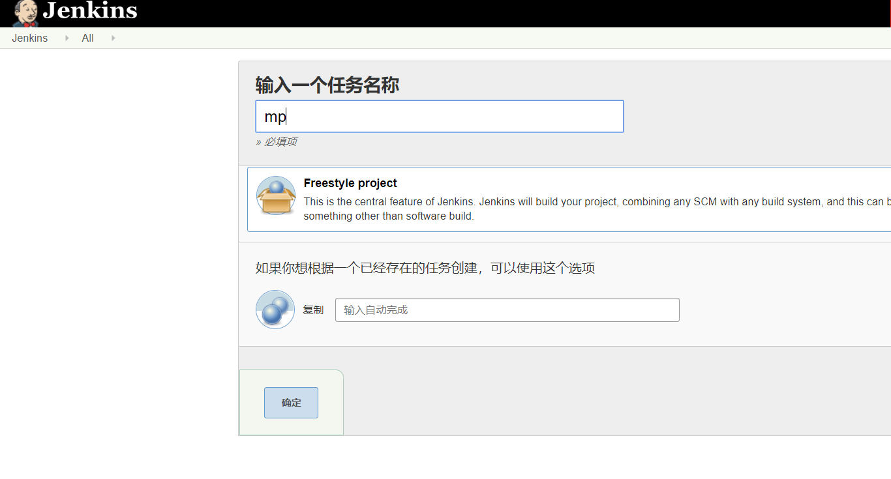
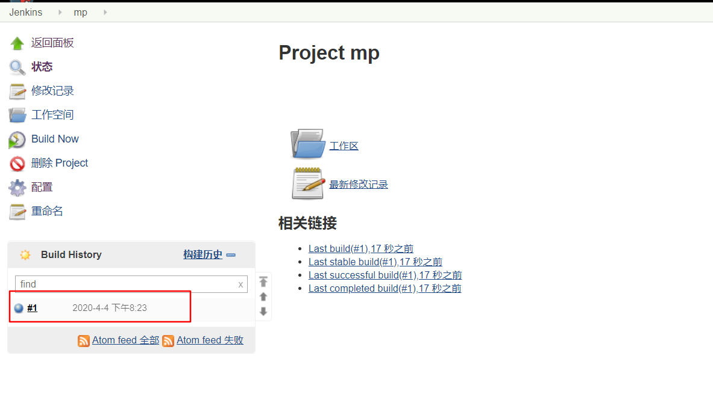
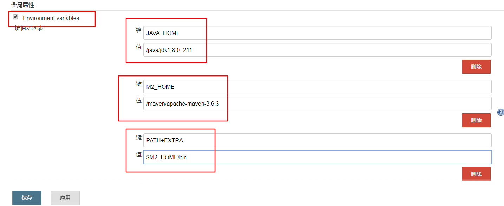

# 创建Git任务

新建任务选择 freestyle



源码管理中设置git仓库，分支，及凭据


保存

主页上即可看见刚才创建的项目


进入项目 点击立即构建


可以看见一次执行结果



进入该次构建任务，查看控制台


观察该次构建，可以发现，进入了 `/var/lib/jenkins/workspace/项目名`,在该目录下通过jenkins执行git命令拉取了代码。

如果 没有 git 命令，则需要在jenkins所在的机器上安装git。

# 创建自由风格项目

通过刚才的任务可以知道，jenkins 想要执行声明命令，所在的机器必须要有该命令

## 安装 maven

下载解压

```bash
wget https://mirrors.tuna.tsinghua.edu.cn/apache/maven/maven-3/3.6.3/binaries/apache-maven-3.6.3-bin.tar.gz
tar -zxvf apache-maven-3.6.3-bin.tar.gz
```

修改 `conf/settings.xml`，设置阿里镜像

```xml
<mirror>
    <id>nexus-aliyun</id>
    <mirrorOf>central</mirrorOf>
    <name>Nexus aliyun</name>
    <url>http://maven.aliyun.com/nexus/content/groups/public</url>
</mirror>
```

设置环境变量

修改 `vim /etc/profile`

```bash
export JAVA_HOME=/java/jdk1.8.0_211
export CLASSPATH=.:$JAVA_HOME/lib/dt.jar:$JAVA_HOME/lib/tools.jar
export PATH=$PATH:$JAVA_HOME/bin
export M2_HOME=/maven/apache-maven-3.6.3
export PATH=$PATH:$M2_HOME/bin
```

激活 `source /etc/profile` ,验证 `mvn -v`

## 全局工具设置

进入 jenkins ，系统管理，Global Tool Configuration

设置jdk


设置 maven


## 系统管理

进入 Configure System 添加三个环境变量。`JAVA_HOME,M2_HOME,PATH+EXTRA`



## 任务设置

在之前创建的任务设置中,选择 shell 的方式执行 maven 的打包命令


立即构建测试,页面上可以看见构建成功


增加部署的过程

```bash
mvn clean package -Dmaven.test.skip=true
cp target/mp-1.0-SNAPSHOT.jar /app
cd /app
sh stop.sh
BUILD_ID=dontKillMe
sh start.sh
```

其中 `stop.sh`

```sh
#!/bin/bash
pid=`ps -ef |grep mp.1.0-SNAPSHOT.jar |grep -v grep |awk '{print $2}'`
echo "得到的进程" $pid
if [ -n "$pid" ];then
 echo '杀掉进程' $pid
 kill -9 $pid
fi
```

`start.sh`

```sh
#!/bin/bash
nohup java -jar mp-1.0-SNAPSHOT.jar &
```

