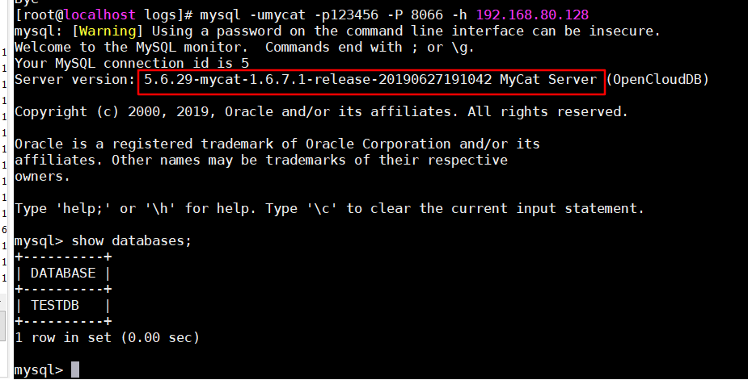

# 概述

mycat 是一款数据库中间件，通过拦截 sql ，分析 sql ，调用具体的真实数据库。

# 安装

解压即可，在 conf 目录下定义配置

`schema.xml` 定义逻辑库，表，节点等内容

`rule.xml` 定义分片规则

`server.xml` 定义系统变量，如端口


# 启动

修改 server.xml ,修改默认的用户名和密码

```xml
<user name="mycat" defaultAccount="true">
    <property name="password">123456</property>
    <property name="schemas">TESTDB</property>
</user>
```

修改 schema.xml ，并在逻辑库中创建数据库 testdb

```xml
<?xml version="1.0"?>
<!DOCTYPE mycat:schema SYSTEM "schema.dtd">
<mycat:schema xmlns:mycat="http://io.mycat/">

        <schema name="TESTDB" checkSQLschema="false" sqlMaxLimit="100" dataNode="dn1">
        </schema>
        <dataNode name="dn1" dataHost="host1" database="testdb" />
        <dataHost name="host1" maxCon="1000" minCon="10" balance="0"
                          writeType="0" dbType="mysql" dbDriver="native" switchType="1"  slaveThreshold="100">
                <heartbeat>select user()</heartbeat>
                <writeHost host="hostM1" url="192.168.80.128:3306" user="root"
                                   password="123456">
                        <readHost host="hostS2" url="192.168.80.129:3306" user="root" password="123456" />
                </writeHost>
        </dataHost>
</mycat:schema>
```

启动，进入bin目录

控制台启动 ./mycat console

后台启动 ./mycat start

进入 mycat

```bash
mysql -umycat -p123456 -P 8066 -h 192.168.80.128
```




