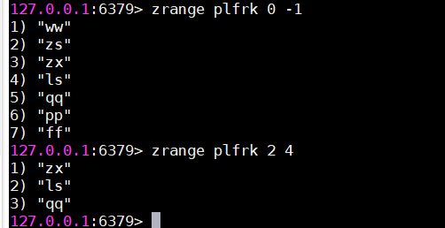

# 数据类型

相同的key会覆盖

## String

`set k v` 设置值    `get k1` 获取值

`append k v` 追加值   `strlen k` 查看值的长度

`incr k` 给值加一，仅数字   `decr k`  给值减一

`incrby k num` 给值加指定的数字  `decrby k num` 给值减指定的数字

`getrange k start end` 得到截取后的字符串   ` setrange k start str` 从目标位置开始设置值

`setex k second v` 设置值同时设置过期时间  `setnx k v` 如果不存在key，则设置

` mset k1 v1 k2 v2` 批量设置    `mget k1 k2` 批量获取

## Hash

`hset k f v`  设置值，值为field 和value的组合  `hget k f` 获取值

`hmset k f1 v1 f2 v2` 批量设置值      ` hmget k f1 f2` 批量获取值

`hgetall k` 获取全部，键值对将按顺序输出       `hdel k f` 删除某个属性  `hlen k` 获取属性个数

`hexists k f` 判断是否存在属性     `hkeys k` 获取所有属性  `hvals k` 获取所有属性值

## List

`lpush k v1 v2 v3` 倒序设置list    `rpush k v1 v2 v3` 设置list  `lrange k start end` 获取list

`lpop/rpop k`  删除一个元素,从左右方向          

`lindex k index` 按下标获取元素  `llen k` 查看元素个数

## Set

`sadd k v1 v2` 设置值，会去掉重复的      `smembers k` 查看元素  

`scard k` 元素个数       `srem k m` 删除成员

## ZSet

可排序的 set ，通过一个 double 类型的 score 值来排序。score值越小排名越前。

`zadd key score value` 添加值，如 `zadd plfrk 11 ls` 当插入新值将重新排序，允许同样的score 值。添加同样的值，但是分数不同，分数会覆盖。

`zcard key` 查看当前key的成员个数。

`zrange key startIndex endIndex` 查询指定下标的元素。 `0 -1` 为全部

  `zrange key start end withscores` 可以把分数一起查出来。

`zrank key value` 查询 该值的排名。

`zcount key startScore endScore` 查询指定分数范围的元素个数。`start<=score<=end`

`zrem key value` 删除指定值

`zscore key value` 得到指定值的分数

`zincrby key score value` 在原值对应的分数上添加分数。正数为增，负数为减。

`zrangebyscore key startScore endScore` 根据分数范围得到值。

`zrevrange key startIndex endIndex`  倒序，从大到小，得到指定索引的值，同样可以加 withscores。

`zrevrangebyscore key startScore endScore` 倒序按分数排名，此时分数也要反着。如`zrevrangebyscore plfrk 12 10`

还可以加上`limit` 如 `zrevrangebyscore plfrk 13 10 limit 1 2` 。 从 1 下标查询 2 个元素。

` zremrangebyscore key startScore endScore` 按分数范围批量删除。

` zremrangebyrank key startIndex endIndex ` 按排名批量删除。

## BitMap

位图，通常用于点赞，收藏，大数据量的情况下，相比传统结果能省很多内存及性能

`setbit {key} {offset} {value}`  设置值，offset为偏移量，相当于索引，value的值只能为0和1

比如 `setbit xx 5 1`  后，数据结构为 xx : 000001 ,在第5位的值为1，之前的值默认为0

`getbit {key} {offset}` 获取指定偏移量 的值

## Geo

用来描述地理位置的数据结构，以地球的经纬度体系作为参数

`geoadd {key} {long} {lat} {member}` 添加一个成员到指定的key，同时设置经纬度

`geopos {key} {member}` 查看一个成员的经纬度

`geodist {key} {m1} {m2} [unit]` 查看两个成员的距离，可用指定单位，默认为米

`georadius {key} {long} {lat} {radius} {unit}` 查看指定经纬度，指定半径范围内的成员

`georadiusbymember {key} {member} {radius} {unit}` 查看指定成员的半径范围内的所有成员

## HyperLog

用来统计基数的结构，适用于大数据量的情况下

`pfadd {key} {v}` 添加

`pfcount {key}` 计数