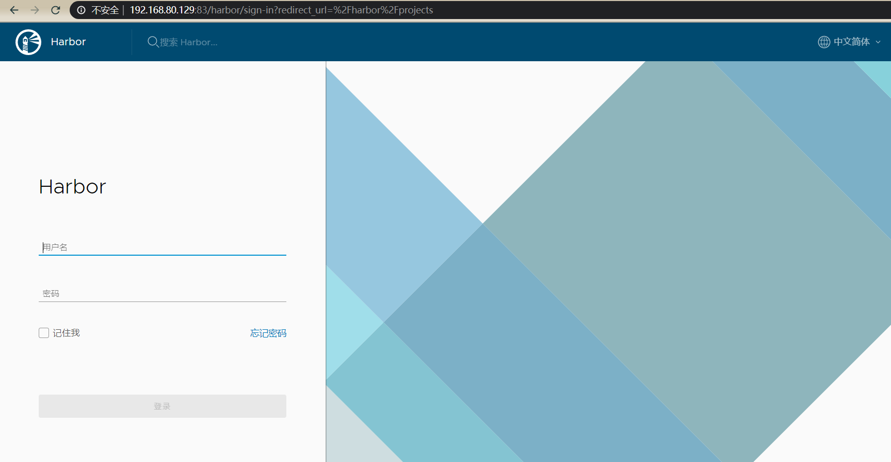
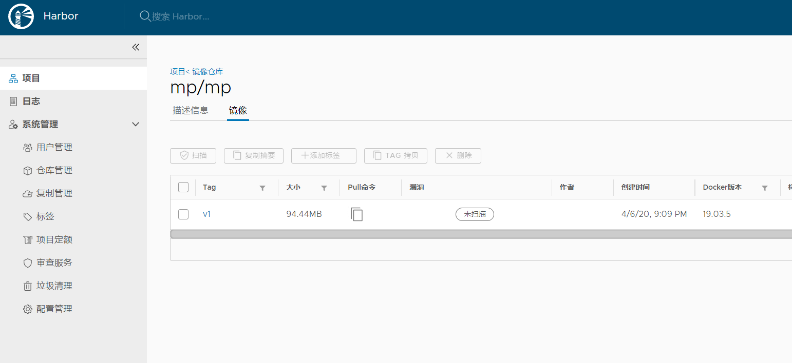
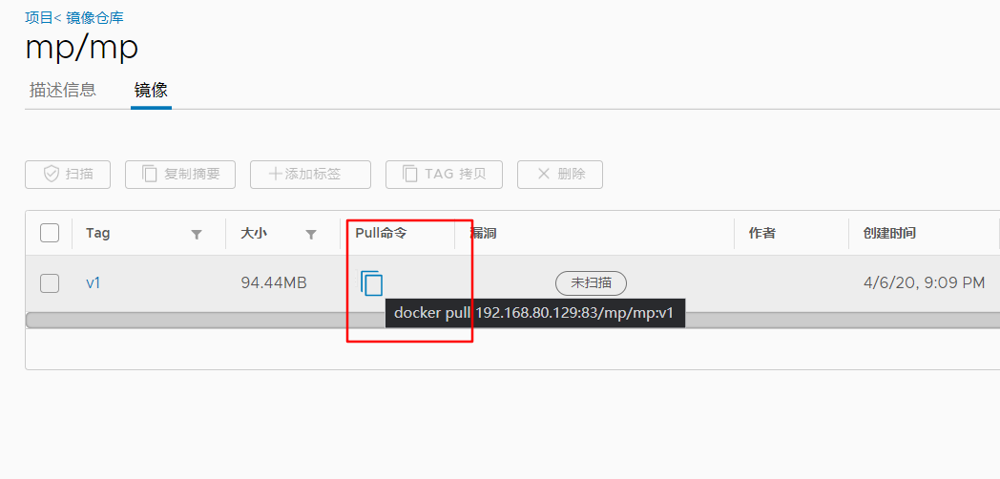

# 概述

作为 docker 一个镜像仓库。

# 安装

1，首先安装 docker-compose

```bash
curl -L https://get.daocloud.io/docker/compose/releases/download/1.25.4/docker-compose-`uname -s`-`uname -m` > /usr/local/bin/docker-compose
chmod +x /usr/local/bin/docker-compose
```

验证

```bash
docker-compose -version
```

2,下载 harbor

从 `https://github.com/goharbor/harbor/releases/download/v1.9.4/harbor-offline-installer-v1.9.4.tgz`上下载安装包

解压

```bash
tar -zxvf harbor-offline-installer-v1.10.1.tgz
```

编辑 

```bash
vim harbor.yml
```
修改host和端口，新版本还需要注释掉 https 相关

```yaml
hostname: 192.168.80.129
http:
  port: 83
```

安装

```bash
./prepare
./install.sh
```

之后暴露设置的端口，访问页面



默认用户为 admin/Harbor12345 ，这个可以在yml中设置


# 使用

## 上传

编辑

```bash
vim /etc/docker/daemon.json
```

添加harbor的ip受信任

```json
{
  "registry-mirrors": ["https://ap52n48m.mirror.aliyuncs.com"],
  "insecure-registries":["192.168.80.129:83"]
}
```

重启docker

```bash
systemctl restart docker
```

进入harbor目录重启 harbor

```bash
 docker-compose down -v
 docker-compose up -d
```

命令登录 harbor,之后输入harbor的用户名和密码

```bash
docker login 192.168.80.129:83
```

执行上传，首先进行tag标记，会生成一个新的image，然后上传

```bash
docker tag mp:v1 192.168.80.129:83/mp/mp:v1
docker push 192.168.80.129:83/mp/mp:v1
```

随后页面上查看镜像



## 下载

首先，需要和上面一样，开启docker对harbor服务的信任。并重启docker。

在页面上复制拉取镜像的命令



```bash
docker pull 192.168.80.129:83/mp/mp:v1
```

如果是私有仓库则需要先登录。

# 实际场景

安装 sshpass ，可以执行带密码的远程命令

```bash
yum install sshpass
```

通过 maven插件或命令，制作镜像，并上传harbor

```groovy
stage('build project') {
    steps {
        sh 'mvn clean package -Dmaven.test.skip=true docker:build'
    }
}
stage('upload image'){
    steps{
        sh 'docker tag mp:latest 192.168.80.129:83/mp/mp:latest'
        sh 'docker login -u admin -p Harbor12345 192.168.80.129:83'
        sh 'docker push 192.168.80.129:83/mp/mp:latest'
    }
}
stage('start project'){
    steps{
        sh 'sshpass -p "123456" ssh root@192.168.80.129 "docker pull 192.168.80.129:83/mp/mp:latest"'
        sh 'sshpass -p "123456" ssh root@192.168.80.129 "docker run -p8083:8083 -d 192.168.80.129:83/mp/mp:latest"'
    }
}
```

执行远程命令，启动服务。


