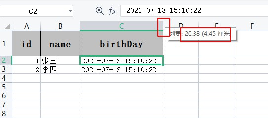

# 概述

easyexcel 是阿里开源的一款 excel 处理工具，api相对简洁好用，解决poi带来的大内存及速度慢的问题。

https://github.com/alibaba/easyexcel

# 使用

引入依赖

```xml
<dependency>
    <groupId>com.alibaba</groupId>
    <artifactId>easyexcel</artifactId>
    <version>2.2.10</version>
</dependency>
```

写入本地

```java
@Test
void test1(){
    List<Student> students=new ArrayList<>();
    students.add(new Student(1, "张三", new Date()));
    students.add(new Student(2, "李四", new Date()));

    String fileName = "D://呵呵.xlsx";
    EasyExcel.write(fileName, Student.class).sheet("模板").doWrite(students);
}
```

导出

```java
@PostMapping("/export")
public void export(@RequestBody SearchParam param, HttpServletResponse response) throws IOException {
    List<Student> students = data();

    response.setContentType("application/vnd.ms-excel");
    response.setCharacterEncoding("utf-8");
    // 这里URLEncoder.encode可以防止中文乱码 当然和easyexcel没有关系
    String fileName = URLEncoder.encode("学生信息", "UTF-8").replaceAll("\\+", "%20");
    response.setHeader("Content-disposition", "attachment;filename*=utf-8''" + fileName + ".xlsx");

    EasyExcel.write(response.getOutputStream(), Student.class).sheet("学生列表").doWrite(students);
}
```

调整格式

只需再对应实体类，使用注解调整

```java
@Data
@NoArgsConstructor
@AllArgsConstructor
// 头部样式
@HeadStyle
// 内容行高
@ContentRowHeight(20)
// 内容居中
@ContentStyle(horizontalAlignment = HorizontalAlignment.CENTER)
public class Student {

    // 每列宽度
    @ColumnWidth(10)
    // 列名
    @ExcelProperty("学生id")
    private Integer id;

    @ColumnWidth(8)
    @ExcelProperty("姓名")
    private String name;

    @ColumnWidth(23)
    @ExcelProperty("生日")
    @JSONField(format = "yyyy-MM-dd HH:mm:ss")
    private Date birthDay;
}
```

列宽建议使用拉到合适的宽度，记录下来，挨个设置



