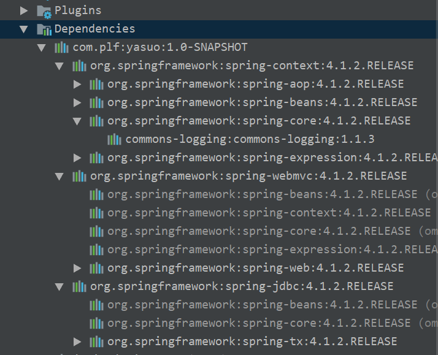

# maven

## 概述

maven是一个构建工具，可以将源代码自动 清理 编译，测试，打包，部署

常见构建工具  ant >  maven > gradle

## 安装

进入maven的官网下载，<http://maven.apache.org/> 

maven 仓库地址 ，<https://mvnrepository.com/> 

解压安装在一个没有中文和空格的路径下，

1，检查java的环境，`JAVA_HOME`,path

2,添加`MAVEN_HOME` 或者 `M2_HOME` 指定为maven的根目录,ex:`F:\CodeSoft\apache-maven-3.5.2`

path中添加，maven的bin目录, ex：`%M2_HOME%\bin`

3,验证 使用命令,如果能查看版本信息，表示设置完成

```bash
mvn -v
```

## 设置

我们进入maven根目录下的conf目录，编辑`settings.xml`文件,这个是默认的配置文件，IDE编辑器也可以指定其他配置文件。直接使用命令，就会加载这个默认配置，修改的时候这里面有很多例子，照着改

1,指定仓库目录

默认会在用户目录下的`.m2/reposistory`,会占用c盘空间，指定一个其他目录

```xml
<localRepository>F:\m2\repository</localRepository>
```

2,设置镜像

以防网络问题，设置成可以快速访问的镜像仓库,在mirrors节点下添加

```xml
<mirror>
    <id>aliyunmaven</id>
    <mirrorOf>*</mirrorOf>
    <name>阿里云公共仓库</name>
    <url>https://maven.aliyun.com/repository/public</url>
</mirror>
```

3,设置编译版本

maven默认以1.5来编译，需要指点版本,在profiles节点下添加

```xml
<profile>    
    <id>jdk-1.8</id>    
    <activation>    
        <activeByDefault>true</activeByDefault>    
        <jdk>1.8</jdk>    
    </activation>    
    <properties>    
        <maven.compiler.source>1.8</maven.compiler.source>    
        <maven.compiler.target>1.8</maven.compiler.target>    
        <maven.compiler.compilerVersion>1.8</maven.compiler.compilerVersion>    
    </properties>    
</profile>
```

## 目录结构

maven有一套默认的目录结构，需要遵守，才能让maven发现

hello                 项目的根目录，目录名称为项目名

|——src           项目的源代码

|——|——main          存放主程序和资源文件

|——|——|——java   主程序java代码

|——|——|——resources    资源文件，配置文件

|——|——|——webapp   web项目的根目录,下面有WEB-INF/web.xml

|——|——test    测试程序

|——|——|——java   测试程序java代码

|——|——|——resources  测试用的资源

|——pom.xml    **核心**,maven配置文件，project object model.描述整个项目

## pom文件

创建一个maven工程，手动创建目录结果，加上pom文件

```xml
<?xml version="1.0" encoding="UTF-8"?>
<project xmlns="http://maven.apache.org/POM/4.0.0"
         xmlns:xsi="http://www.w3.org/2001/XMLSchema-instance"
         xsi:schemaLocation="http://maven.apache.org/POM/4.0.0 http://maven.apache.org/xsd/maven-4.0.0.xsd">
    <modelVersion>4.0.0</modelVersion>
	<!--以上都是固定的-->
    
    <groupId>com.plf</groupId>
    <artifactId>zoe</artifactId>
    <version>v0.1</version>


</project>
```

maven需要通过至少三个向量来描述一个项目,也称坐标

gourp id ：组织id，通常是组织类型.组织名称

artifact id: 产品id， 通常是项目名称

version :版本 

## 打包方式

在packaging节点中指定打包方式,可以指定三个值

```xml
<packaging>war</packaging>
```

jar: 默认值，打成一个独立的jar包

war: 打出一个war包，会把依赖的jar包复制到war包里的WEB-INF/lib下

pom:作为父项目，不打包程序和资源，安装时会拷贝pom文件到本地仓库

## 命令

maven执行所有命令都是需要插件，mvn核心程序回去查看仓库中有没有这些插件，没有的话，会去联网下载插件，再去调用这些插件执行命令

一个插件(plugin)是一个或多个目标(goal)的集合,比如编译插件maven-compiler-plugin有两个目标，compile和

test-compile，分别编译主程序和测试程序的代码

### 清理

删除target目录

```bash
mvn clean
```

### 编译

编译主程序，会在项目根目录下生成target目录，编译好的class文件会放在classes目录下

```bash
mvn compile
```

编译测试程序,放在test-classes

```bash
mvn test-compile
```

### 测试

执行测试程序  

```bash
mvn test
```

跳过测试

1  添加`-DskipTests`来跳过测试的执行,但是依旧会编译测试类

2  添加 `-Dmaven.test.skip=true`, 不编译测试类,不执行测试

### 打包

在target目录下生成jar包或者war包

```bash
mvn package 
```

### 安装

将jar包安装到本地仓库

```bash
mvn install
```

## 依赖

需要在`<dependencies>`节点下添加依赖

```xml
<dependencies>
    
    <dependency>
        <groupId>com.plf</groupId>
        <artifactId>zoe</artifactId>
        <version>v0.1</version>
    </dependency>
    
</dependencies>
```


### 范围

在dependency 下的节点中设置 `<scope>`

**compile** : 默认值，对主程序，测试程序都可见，参与打包

**test**: 只对测试程序可见，不参与打包,

ex：junit

```xml
<dependency>
    <groupId>junit</groupId>
    <artifactId>junit</artifactId>
    <version>4.12</version>
    <scope>test</scope>
</dependency>
```

**provided**: 

通常用在web项目，由于开发web项目需要servlet，jsp等依赖，这些依赖是由服务器如tomcat提供，在tomcat的lib下

但是开发过程主程序需要这些依赖，不然无法编译，但是不参与打包,没设置的话，会与tomat提供的jar包冲突

ex:servlet-api.jsp-api

```xml
<dependency>
    <groupId>javax.servlet</groupId>
    <artifactId>javax.servlet-api</artifactId>
    <version>4.0.1</version>
    <scope>provided</scope>
</dependency>

<dependency>
    <groupId>javax.servlet.jsp</groupId>
    <artifactId>jsp-api</artifactId>
    <version>2.1</version>
    <scope>provided</scope>
</dependency>
```

**runtime**:测试和运行时需要，编译时不需要

**system**:不推荐，从当前系统的绝对路径下的jar包，需同时指定`<systemPath>`节点

### 传递

直接一个依赖包如果依赖了其他依赖，会自动导入其他间接依赖



以上我们依赖了一个项目，而这个项目依赖的spring-context,spring-webmvc和spring-jdbc

context会自动依赖核心的四个包，aop,beans,core,expression,而core会依赖commons-logging

spring-webmvc依赖了spring-web,而且spring-jdbc依赖了spring-tx

这些间接依赖包都会自动导入,不需要依次导入

### 排除

在依赖中添加`exclusions`指定要排除的依赖，当前项目不再引入该间接依赖，可以使用`*`通配符

```xml
<dependency>
    <groupId>org.springframework</groupId>
    <artifactId>spring-context</artifactId>
    <version>${spring.version}</version>
    <exclusions>
        <exclusion>
            <groupId>*</groupId>
            <artifactId>*</artifactId>
        </exclusion>
    </exclusions>
</dependency>

<dependency>
    <groupId>org.springframework</groupId>
    <artifactId>spring-webmvc</artifactId>
    <version>${spring.version}</version>
    <exclusions>
        <exclusion>
            <groupId>org.springframework</groupId>
            <artifactId>spring-context</artifactId>
        </exclusion>
    </exclusions>
</dependency>
```

### 集中管理

将版本集中管理，方便构建,在`properties`节点中指定，使用`${xxx}`表达式来选择

```xml
 <properties>
     <spring.version>4.1.2.RELEASE</spring.version>
</properties>

<dependencies>
    <dependency>
        <groupId>org.springframework</groupId>
        <artifactId>spring-webmvc</artifactId>
        <version>${spring.version}</version>
    </dependency>

    <dependency>
        <groupId>org.springframework</groupId>
        <artifactId>spring-jdbc</artifactId>
        <version>${spring.version}</version>
    </dependency>

</dependencies>
```

### 冲突

当引入的依赖，间接依赖，重复且版本不一致时，maven会按照几条规则来选择版本

1，就近原则。间接依赖的中间传递者越少，越优先。如果直接依赖了，会直接使用直接依赖的版本

2，声明顺序，如果间接依赖的传递者一样，会按照在pom中的dependency的声明顺序选择,先声明优先

### 依赖管理器

使用依赖管理器可以管理依赖各种属性，如版本，排除。但是不会实际导入依赖，而当实际导入依赖的时候，不需要再配置这些属性，依赖管理器可以继承

```xml
<dependencyManagement>
    <dependencies>       
        <dependency>
            <groupId>org.springframework</groupId>
            <artifactId>spring-context</artifactId>
            <version>${spring.version}</version>
        </dependency>
    </dependencies>
</dependencyManagement>

<dependencies>
    <dependency>
        <groupId>org.springframework</groupId>
        <artifactId>spring-context</artifactId>
    </dependency>
</dependencies>
```


## 生命周期

maven有三个独立的生命周期，执行不同的生命周期阶段(phase)的命令，会从指点的顺序依次执行到目标命令

### clean

clean:清理target

### defalut

默认的周期，包含大部分命令,依次按照以下顺序执行

1,compile   

调用maven-resources-plugin ,拷贝主程序下的src/main/resources资源文件到target/classes

调用maven-compiler-plugin，编译src/main/java下的java文件，存放在target/classes

2，test-compile

调用maven-resources-plugin ,拷贝测试程序下的src/test/resources资源文件到target/test-classes

调用maven-compiler-plugin，编译src/test/java下的java文件，存放在target/test-classes

3,test

调用 maven-surefire-plugin ，执行测试程序junit,生成测试报告在target\surefire-reports

4,package

调用 maven-war-plugin 或者  maven-jar-plugin 打包

5，install

调用maven-install-plugin,拷贝jar包和pom文件到本地仓库

### site

site:生成站点

## 继承

在maven项目中指点打包方式为pom,就可以被继承，pom项目不会编译打包任何代码资源，可以删掉src目录,父项目无法知道自己被谁继承了

```xml
<packaging>pom</packaging>
```

在子项目中指点父项目

```xml
<parent>
    <groupId>com.plf</groupId>
    <artifactId>jax</artifactId>
    <version>1.0-SNAPSHOT</version>
</parent>
```

可以继承父项目的依赖管理器,子项目无需指定版本

## 聚合

在父项目中，指定modules，值需要指定为子项目的项目路径，子项目无法知道自己被谁聚合了

```xml
<modules>
    <module>../yasuo</module>
    <module>../zoe</module>
</modules>
```

聚合工程执行父项目命令，子项目同样会执行相同的命令

## 构建过程

在`build`节点中可以指定构建的一些特殊设置和插件

1,最终包名

默认包名为 项目名-版本号,可以重新指定包名

```xml
<finalName>final-xxx</finalName>
```

2,资源文件属性注入

在build中指定资源文件目录，开启属性过滤 

```xml
<properties>
    <db.username>root</db.username>
    <db.password>123</db.password>
</properties>

<build>
    <resources>
        <resource>
            <directory>src/main/resources</directory>
            <filtering>true</filtering>
        </resource>
    </resources>
</build>
```

在resources目录下，创建db.properties

```properties
db.username=${db.username}
db.password=${db.password}
```

执行编译命令,查看classes生成的文件,属性已替换

```properties
db.username=root
db.password=1234
```

3，文件的排除和引入

插件默认会把src/main/resources的文件全部打包进来

有的resources里的文件不希望打包进来，有的文件通常和java文件写在一起(mybatis映射文件),希望引入,有些文件在

其他目录下。可以通过exclude和include来指定引入和排除的资源文件

directory为相对于项目根目录的相对路径

```xml
<resources>
    <resource>
        <directory>src/main/resources</directory>
        <filtering>false</filtering>
        <excludes>
            <exclude>a/*.txt</exclude>
        </excludes>
    </resource>
    <resource>
        <directory>src/main/java</directory>
        <includes>
            <include>**/*.xml</include>
        </includes>
    </resource>
    <resource>
        <directory>src/config</directory>
        <includes>
            <include>*</include>
        </includes>
    </resource>
</resources>
```


## profiles

profiles可以针对激活的profile做出一些特殊的处理，常用于不同的环境打不同的包

我们在src/config下有两个目录,dev和test，里面存放了不同环境的配置文件

在profiles中配置两个profile，分别指定id，默认激活dev

```xml
<profiles>
    <profile>
        <id>zoe.dev</id>
        <activation>
            <activeByDefault>true</activeByDefault>
        </activation>
        <build>
            <resources>
                <resource>
                    <directory>src/config/dev</directory>
                    <includes>
                        <include>**/*</include>
                    </includes>
                    <targetPath>db</targetPath>
                </resource>
            </resources>
        </build>
    </profile>
    
    <profile>
        <id>zoe.test</id>
        <build>
            <resources>
                <resource>
                    <directory>src/config/test</directory>
                    <includes>
                        <include>**/*</include>
                    </includes>
                    <targetPath>db/</targetPath>
                </resource>
            </resources>
        </build>
    </profile>
</profiles>
```

在命令后面添加 `-P${profile.id}`, ex:`-Pzoe.test`, 来激活profile，产生相应的行为

以上就是激活test，就把test的配置加载进，不同的环境打不同的包

除了资源文件，还可以指定其他很多行为

## 常用插件

### tomcat7

使用tomcat7插件可以不使用真正的tomcat启动服务， 命令 `mvn tomcat7:run`,

```xml
<build>
    <plugins>

        <plugin>
            <groupId>org.apache.tomcat.maven</groupId>
            <artifactId>tomcat7-maven-plugin</artifactId>
            <version>2.2</version>
            <configuration>
                <path>/zoe</path>
                <port>9090</port>
                <uriEncoding>UTF-8</uriEncoding>
            </configuration>
        </plugin>

    </plugins>
</build>
```


