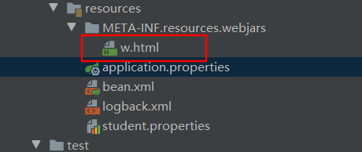
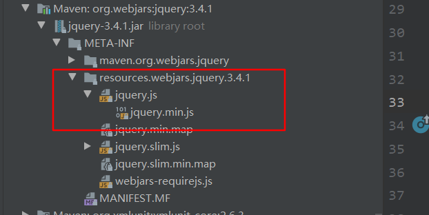

# 资源映射规则

由于 spring-boot 是 jar 包的方式运行，不存在 webapp 目录，静态资源的映射需要别的规则

## webjar

请求路径为 `/webjars/**` 映射到 `classpath:/META-INF/resources/webjars/`



类路径下有该资源`classpath:/META-INF/resources/webjars/w.html`

请求路径 `http://localhost:8081/webjars/w.html`  访问页面

不过通常不会将页面写在该处，而是用作第三方的静态资源包，比如 jQuery ，去网站`https://www.webjars.org/ `上寻找对应的依赖，以 jar 包的形式引入静态资源。

```xml
<dependency>
    <groupId>org.webjars</groupId>
    <artifactId>jquery</artifactId>
    <version>3.4.1</version>
</dependency>
```

该 jar 包包含了静态资源，

请求路径 `http://localhost:8081/webjars/jquery/3.4.1/jquery.js` 即可

页面使用绝对路径引入资源

```html
<script src="/webjars/jquery/3.4.1/jquery.js"></script>
<script>
    $(function () {
        alert("webjars")
    })
</script>
```

## 静态资源

当访问 `/**`的时候，会去寻找

```
"classpath:/META-INF/resources/",
"classpath:/resources/", 
"classpath:/static/", 
"classpath:/public/"
/ 
```

## 欢迎页

默认访问静态资源路径下的 `index.html` ，没有则 404

## 图标

默认图标为静态资源路径下的`favicon.ico` ，如果不能立即生效，注意清理浏览器缓存

## 自定义

使用`spring.resources.static-locations`配置自定义静态资源路径，能够被请求访问。多个使用逗号隔开

```properties
spring.resources.static-locations=classpath:/page/,classpath:/hello/
```


# 模板引擎

spring-boot 推荐使用 thymeleaf 作为模板引擎

## 基本使用

引入 thymeleaf 的启动器

```xml
<dependency>
    <groupId>org.springframework.boot</groupId>
    <artifactId>spring-boot-starter-thymeleaf</artifactId>
</dependency>
```

可以看到自动配置类的默认参数，类路径下的`templates`目录下的`html`文件将会自动渲染

```java
@ConfigurationProperties(prefix = "spring.thymeleaf")
public class ThymeleafProperties {

	private static final Charset DEFAULT_ENCODING = StandardCharsets.UTF_8;

	public static final String DEFAULT_PREFIX = "classpath:/templates/";

	public static final String DEFAULT_SUFFIX = ".html";
```

在 类路径下`templates`目录下编写`success.html`，在controller请求隐射到`success`

当访问`http://localhost:8081/success `时会转发到`classpath:/templates/success.html`

```java
@Slf4j
@Controller
public class HelloController {

    @RequestMapping("success")
    public String success(){
        return "success";
    }
}
```

## thymeleaf语法

在头部添加`xmlns:th="http://www.thymeleaf.org"`，编辑器会增加提示功能

使用 `th:text="${域对象}"`,修改节点内容，如果经过了渲染，则从域对象中取值，替换预置的文本

```html
<!DOCTYPE html>
<html lang="en" xmlns:th="http://www.thymeleaf.org">
<head>
    <meta charset="UTF-8">
    <title>Title</title>
</head>
<body>
<h1>success </h1>
<p>你好,<span th:text="${user}">用户</span></p>
</body>
</html>
```

请求的controller存入域对象的属性值

```java
@RequestMapping("success")
public String success(Model model){
    model.addAttribute("user","张三");
    return "success";
}
```


# 扩展SpringMVC

当需要添加拦截器等操作时，可以使用之前的 xml 的方式，在启动类通过`@ImportResource`中引入 xml 配置

也可以通过配置类的形式, 继承`WebMvcConfigurerAdapter`类，重写需要改变的方法

```java
@Configuration
public class MvcExtendConfig extends WebMvcConfigurerAdapter {

    @Override
    public void addInterceptors(InterceptorRegistry registry) {
        registry.addInterceptor(new MyInterceptor());
        super.addInterceptors(registry);
    }
}
```

# Servlet容器

## 修改设置

一，通过配置文件

与容器相关的，前缀为`server.xxx`

```properties
server.port=8081
server.servlet.context-path=/sb
```

与指定容器类型相关的为 `server.容器名.xxx`, 如`server.tomcat`

```properties
server.tomcat.uri-encoding=utf-8
```

二，编程式

spring-boot 提供了 很多`XxxCustomizer` 接口,用来给用户定制自己的配置，当容器中有`XxxCustomizer` 的bean，便会将需要配置的bean对象放入该方法，进一步定制

```java
@Component
public class TomcatCustomizerImpl implements WebServerFactoryCustomizer<ConfigurableWebServerFactory> {
    @Override
    public void customize(ConfigurableWebServerFactory factory) {
        factory.setPort(8089);
    }
}
```

## 注册三大组件

spring-boot中没有 web.xml ，需要通过 bean 的方式添加 servlet，filter和 listener。

spring boot 提供了三种`RegistrationBean`，可以将三大组件注册到servlet容器中

```java
@Bean
public ServletRegistrationBean<MyServlet> myServlet() {
    ServletRegistrationBean<MyServlet> registrationBean = new ServletRegistrationBean<>(new MyServlet(), "/my");
    registrationBean.setLoadOnStartup(1);
    return registrationBean;
}

@Bean
public ServletListenerRegistrationBean<MyListener> myListener(){
    return new ServletListenerRegistrationBean<>(new MyListener());
}

@Bean
public FilterRegistrationBean<MyFilter> myFilter(){
    FilterRegistrationBean<MyFilter> registrationBean = new FilterRegistrationBean<>();
    registrationBean.setFilter(new MyFilter());
    registrationBean.addUrlPatterns("/my");
    return registrationBean;
}
```

## 切换容器

spring boot 默认使用 tomcat，如要切换，先排除`starter-tomcat`，引入其他容器的 starter 即可

```xml
<dependency>
    <groupId>org.springframework.boot</groupId>
    <artifactId>spring-boot-starter-web</artifactId>
    <exclusions>
        <exclusion>
            <artifactId>spring-boot-starter-tomcat</artifactId>
            <groupId>org.springframework.boot</groupId>
        </exclusion>
    </exclusions>
</dependency>

<dependency>
    <artifactId>spring-boot-starter-jetty</artifactId>
    <groupId>org.springframework.boot</groupId>
</dependency>
```

启动

```
Jetty started on port(s) 8089 (http/1.1) with context path '/sb'
```

## 外部Servlet容器

首先改变打包方式，改为 war 包

```xml
    <packaging>war</packaging>
```

将 `starter-tomcat` 的 作用域设为 `provided`，将不参与打包

```xml
<dependency>
    <groupId>org.springframework.boot</groupId>
    <artifactId>spring-boot-starter-web</artifactId>
</dependency>

<dependency>
    <groupId>org.springframework.boot</groupId>
    <artifactId>spring-boot-starter-tomcat</artifactId>
    <scope>provided</scope>
</dependency>
```

在 主类同包下，编写 初始化类，把主类作为参数传入

```java
public class ServletInitializer extends SpringBootServletInitializer {

	@Override
	protected SpringApplicationBuilder configure(SpringApplicationBuilder application) {
		return application.sources(SbwwApplication.class);
	}
}
```

而主类不需要变

```java
@SpringBootApplication
public class SbwwApplication {

	public static void main(String[] args) {
		SpringApplication.run(SbwwApplication.class, args);
	}
}
```

启动的时候，使用 外部的tomcat 启动即可，可以支持 jsp

