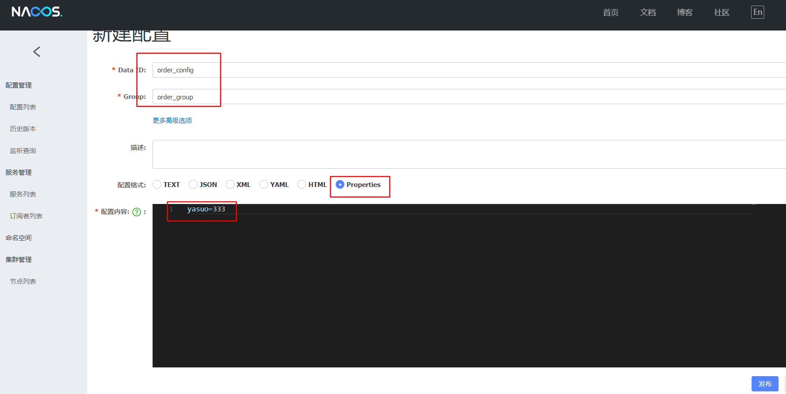

# 概述

通过一个统一的配置中心，改变所有的服务中配置，自动刷新。


# 控制台添加配置



进入配置列表，点击 加号。添加配置，设置 `dataId` 和 `group` 。并配置匹配的文件格式和内容。最后发布。

# 读取配置

引入依赖，`spring-cloud-starter-alibaba-nacos-config` 主要是修改项目相关的配置，如覆盖`application.yml`

而后者 `nacos-config-spring-boot-starter` 是读取`nacos`上任意配置。

```xml
<!--        <dependency>-->
<!--            <groupId>com.alibaba.cloud</groupId>-->
<!--            <artifactId>spring-cloud-starter-alibaba-nacos-config</artifactId>-->
<!--        </dependency>-->

<dependency>
    <groupId>com.alibaba.boot</groupId>
    <artifactId>nacos-config-spring-boot-starter</artifactId>
    <version>0.2.7</version>
</dependency>
```

添加配置中心的地址，此次用的是单独`nacos`层级下的。

```yml
server:
  port: 8080
spring:
  application:
    name: order
  cloud:
    nacos:
      server-addr: localhost:8848

nacos:
  config:
    server-addr: localhost:8848
```

启动类上配置`@NacosPropertySource` 指定 `dataId` 和 `groupId` ，并开启全局自动刷新。

可以声明多个。

```java
@SpringBootApplication
@EnableDiscoveryClient
@NacosPropertySource(dataId = "order_config",groupId = "order_group",autoRefreshed = true)
public class OrderApplication {
```

在某个bean中,通过 `@NacosValue` 标注一个属性，el 表达式指定配置的key，通过`:`指定默认值。此处也要开启自动刷新

```java
@RestController
@RequestMapping("/order")
public class OrderController {

    @NacosValue(value = "${yasuo:100}",autoRefreshed = true)
    private Integer yasuo;

    @GetMapping("/{orderId}")
    public Result<Order> getOrderById(@PathVariable Long orderId){
        log.info("订单编号为{}",orderId);
        Result<Order> result = new Result<>();
        result.setStatus(200);
        result.setMsg("获取成功,yasuo:"+yasuo);
        Order order = new Order();
        order.setOrderId(orderId);
        result.setData(order);
        return result;
    }
}
```

发起请求，修改配置后再次请求，会发现值已经刷新了。